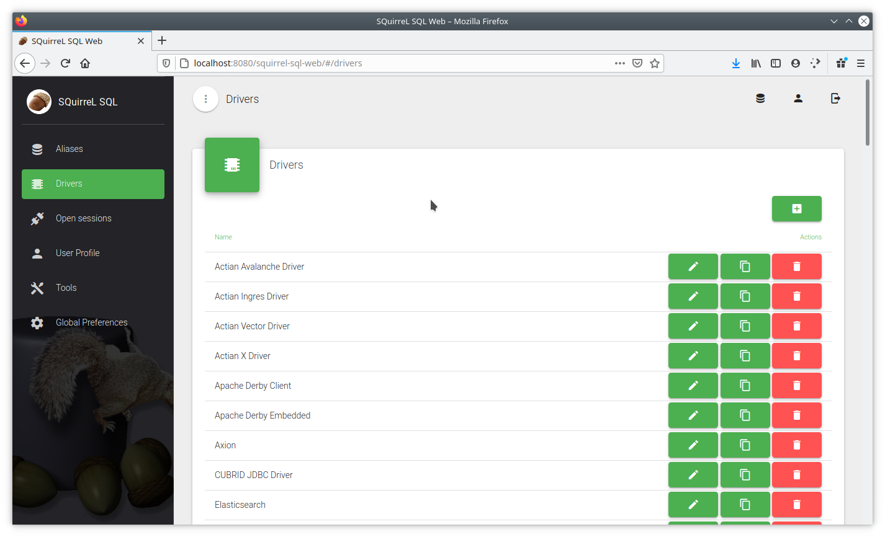
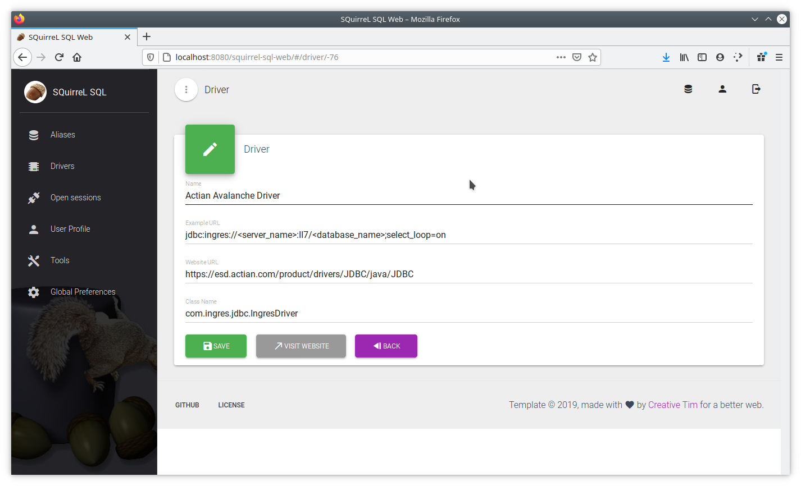
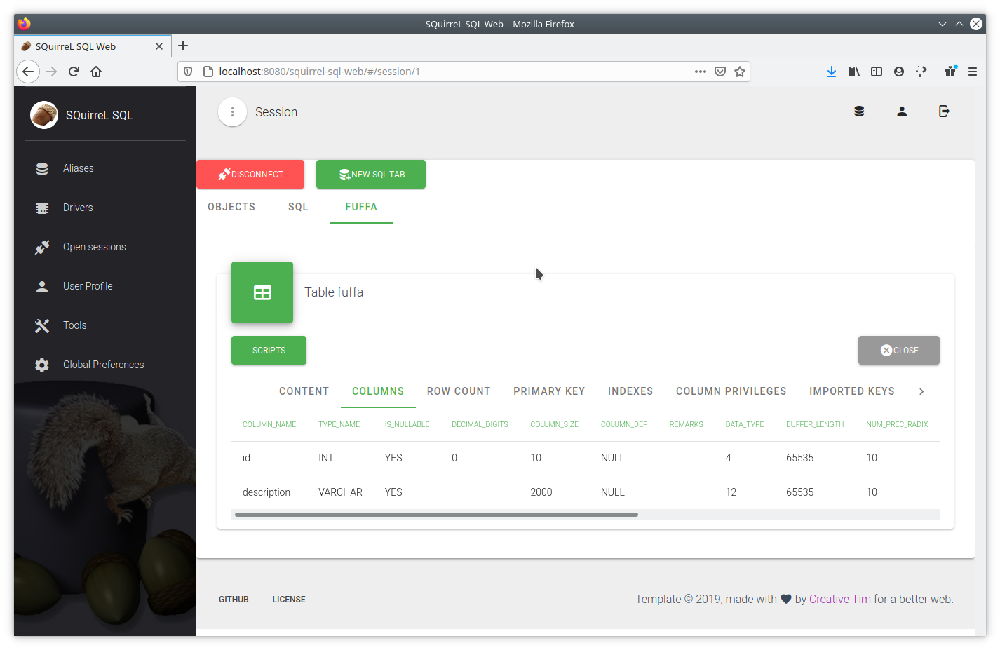
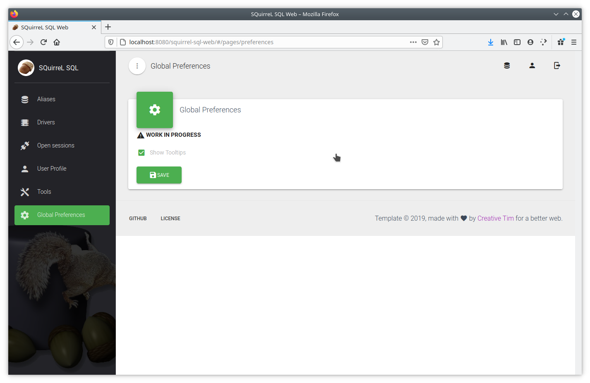

# squirrel-sql-web
SQuirreL SQL Client - Web version

This is a web version of the famous web client.

Frontend: Vuetify Material Dashboard https://www.creative-tim.com/product/vuetify-material-dashboard

Backend: Java EE (JAXRS, EJB, CDI).

Screenshots
----------

Build
-----
You need at least Java (>=8), Maven, nodejs. Compile all with

    mvn package

Run
---
The application is intended to be run in a real EE container (Glassfish, TomEE, JBoss, ...) not Tomcat.

In Glassfish, with default configuration, the app will run at address http://localhost:8080/squirrel-sql-web/

We are using Glassfish 4.1.2 with MOXy patch described [here](https://github.com/eclipse-ee4j/glassfish/issues/21440#issuecomment-422056135)

Project roadmap
---------------

-  Project structure
-  Vue.js frontend
-  Drivers CRUD
-  Driver JAR's selection box
-  Aliases CRUD
-  Alias properties window
-  SQL tab
-  Objects tree tab
-  Database tab
-  Table tab
-  Table "WHERE" and "ORDERBY" clause panels
-  Procedure tab
-  UDT tab
-  Handling with large tables
-  Editing table contents
-  Table import/export
-  Table DDL, Script SQL
-  Procedure source code: Mysql, Oracle, PostGreSQL, ...
-  New session properties window
-  Global preferences window
-  SQuirreL logs window
-  Highlight syntax
-  Web security: authentication (well, we still need to encrypt passwords)
-  Web security: authorizations
-  Users CRUD
-  i18n
-  Github CI (continuous integration)

Authentication
--------------
Default username is `admin` with password `admin`. Users can be configured inside `~/.squirrel-sql/Users.xml`.

Run mock
--------
For frontend development, we can run in mock mode with NodeJS instead of Glassfish:

1. Set `VUE_APP_MOCK=true` in file `.env` or `.env.local`
2. `cd src/main/javascript`
3. `npm start`
